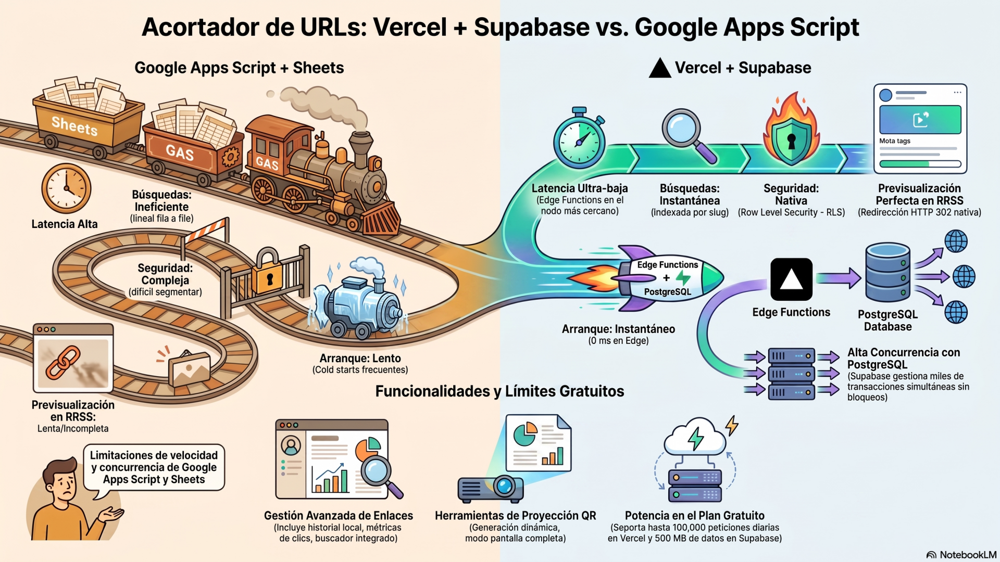
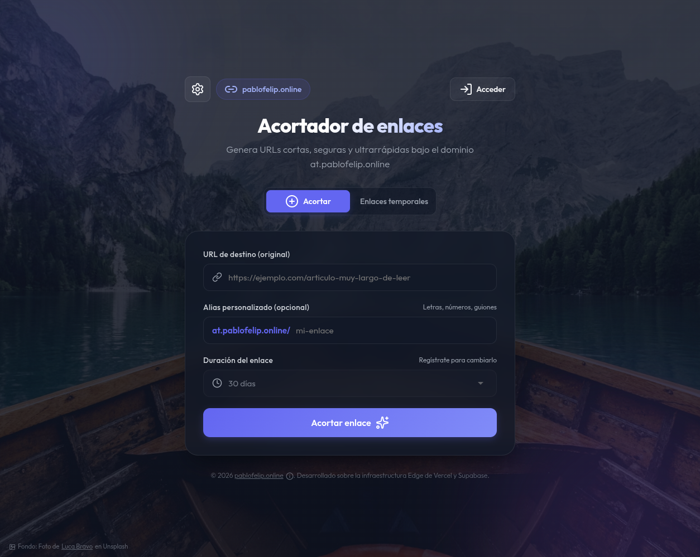
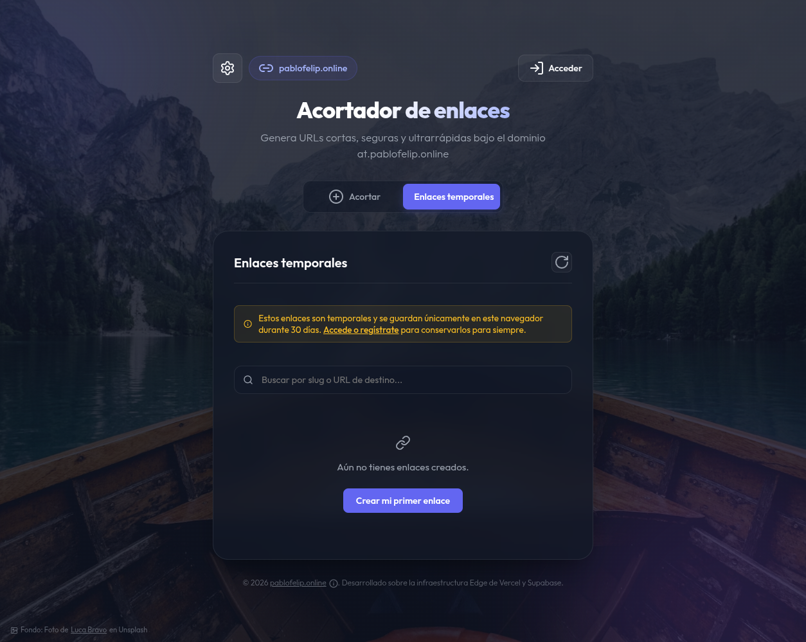
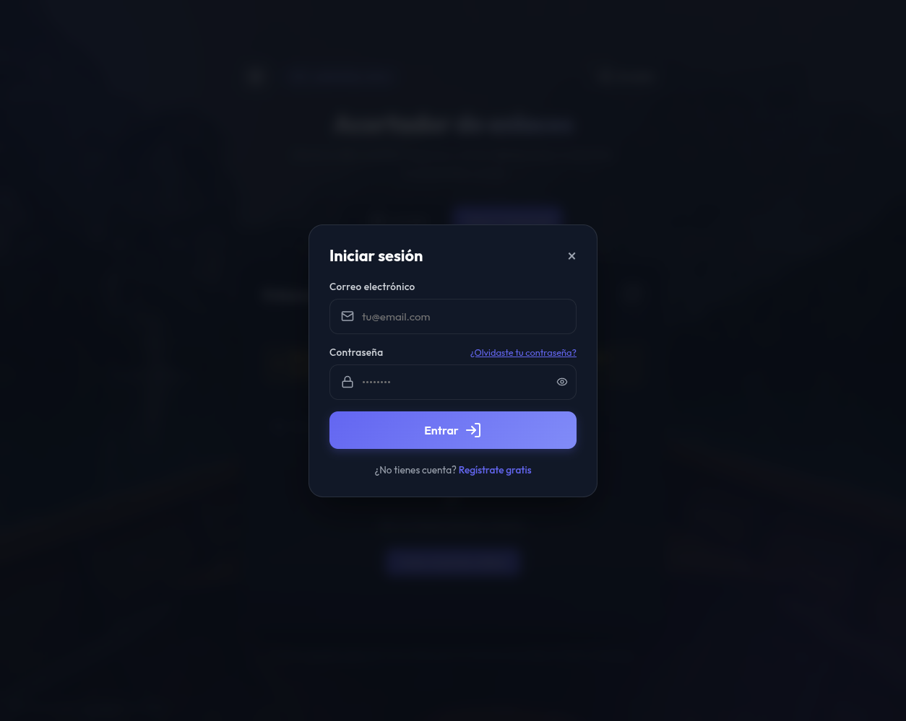
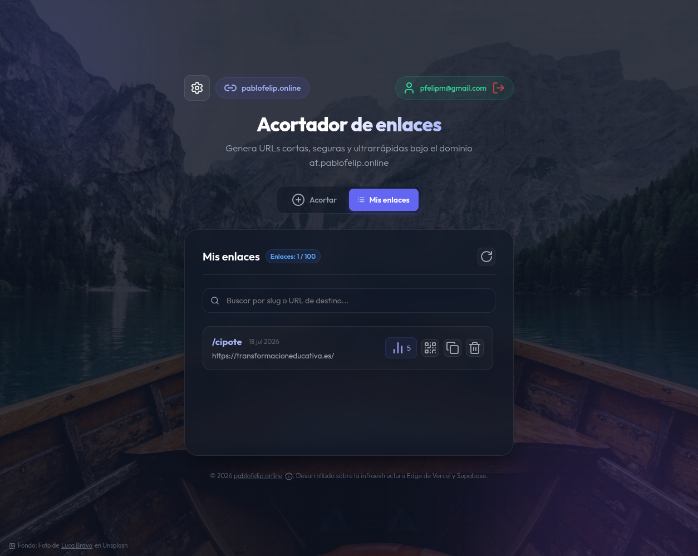
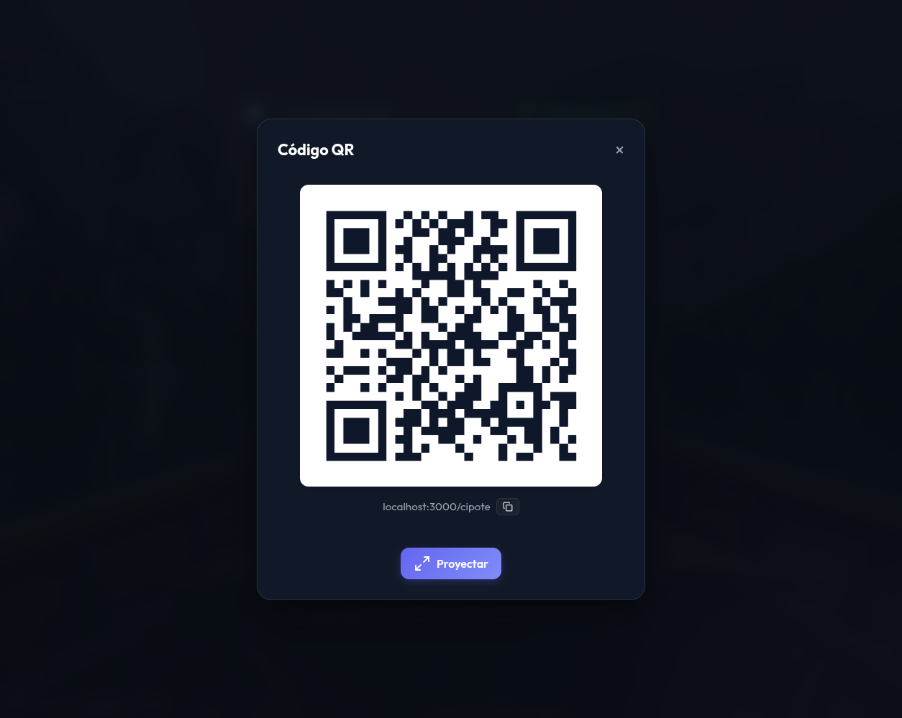
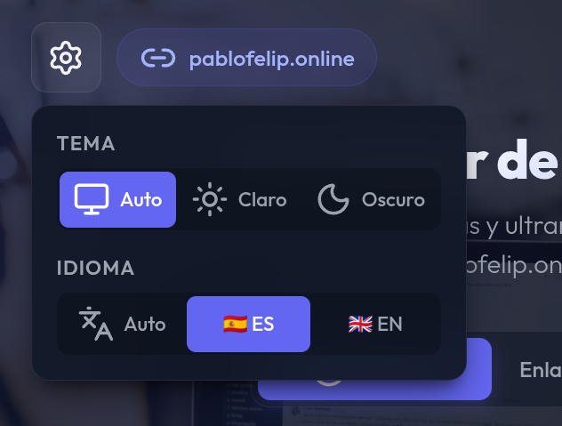
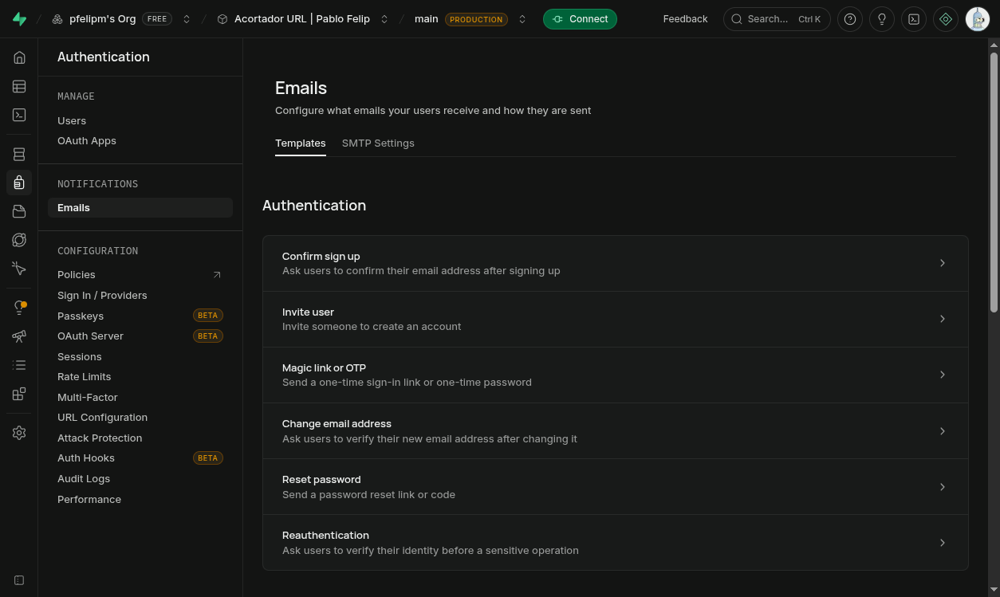
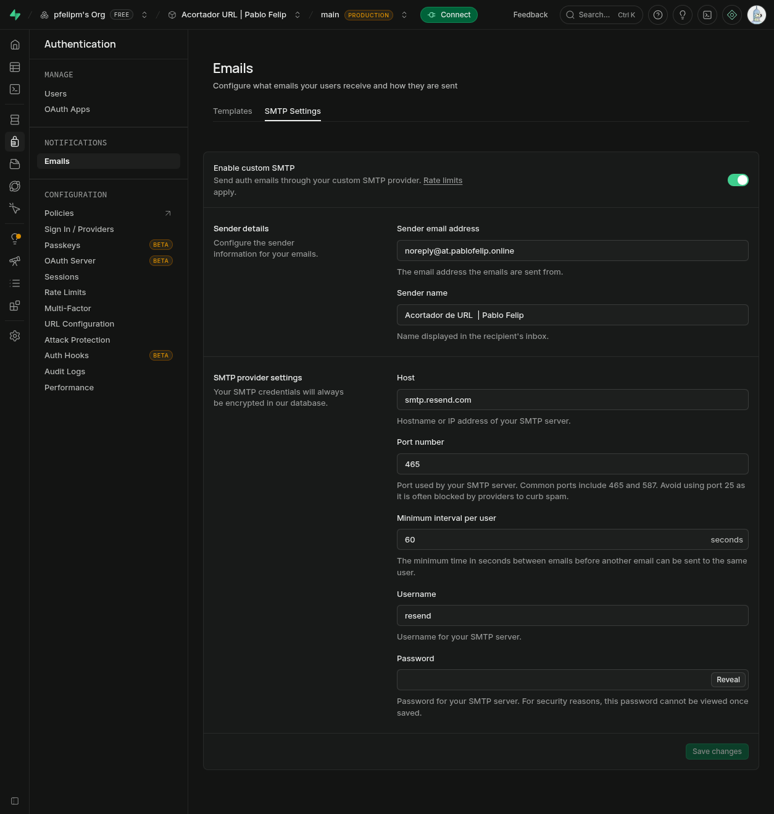

# Acortador de URLs en Vercel & Supabase

<p align="center">
  
</p>

Este proyecto es una aplicación serverless diseñada para alojarse en **Vercel** y utilizar **Supabase** como base de datos, sirviendo URLs cortas bajo tu dominio personalizado (por ejemplo, `at.pablofelip.online/tu-slug`) con redirecciones rápidas del lado del servidor (HTTP 302).

## 🚀 Origen y justificación del stack (el reto)

Este proyecto nació como un experimento y exploración personal a raíz de un reto en una sobremesa de **[GEG Spain](https://transformacioneducativa.es/)**. La propuesta inicial consistía en crear el acortador utilizando **Google Apps Script + Google Sheets**. Sin embargo, la motivación principal del desarrollo fue superar las limitaciones de persistencia de datos e integración de ese ecosistema, logrando una persistencia de datos robusta, escalable y con alto rendimiento fuera del ecosistema de Google Workspace, Google Sheets y Google Apps Script mediante un stack moderno compuesto por **[Vercel](https://vercel.com/) y [Supabase](https://supabase.com/)**.

### Comparativa: Google Apps Script vs. Vercel + Supabase

| Característica | Google Apps Script + Sheets | Vercel (Edge/Serverless) + Supabase (PostgreSQL) |
| :--- | :--- | :--- |
| **Latencia de redirección** | **Alta**: Apps Script y la lectura de Sheets tardan cientos de ms o segundos. | **Ultra-baja**: Ejecución Edge y base de datos optimizada en milisegundos. |
| **Previsualización en RRSS** | **Mala**: La sandbox de Google y el renderizado JS impiden que los bots lean las metaetiquetas. | **Perfecta**: Redirección HTTP 302 nativa que permite a los bots extraer las previews al instante. |
| **Concurrencia** | **Limitada**: Frecuentes bloqueos de escritura (`LockService`) con múltiples usuarios concurrentes. | **Alta**: PostgreSQL gestiona miles de transacciones concurrentes nativamente. |
| **Búsquedas indexadas** | **Ineficiente**: Búsqueda lineal celda por celda sobre las filas de la hoja. | **Instantánea**: Búsqueda indexada sobre la columna del `slug`. |
| **Seguridad** | **Compleja**: Difícil segmentar qué filas puede leer o editar cada usuario invitado. | **Nativa**: Supabase ofrece RLS (*Row Level Security*) para control de accesos granular. |

### ¿Por qué redirecciones en el Edge?

Para entender el rendimiento de este proyecto, resulta útil analizar cómo funcionan las **Edge Functions** (el entorno donde se ejecuta la redirección en Vercel) en comparación con entornos tradicionales:

* **Google Apps Script (Entorno centralizado de Google)**:
  Las Web Apps en Apps Script se ejecutan en servidores centrales de Google Cloud. Cada petición requiere levantar la instancia (sufriendo a menudo de *arranque en frío* o *cold start* de varios segundos), leer la hoja de cálculo linealmente y devolver la respuesta envuelta en un sandbox de seguridad de Google (usando iframes o redirección del lado del cliente mediante JS). Esto ralentiza el proceso e impide que los rastreadores de redes sociales lean las vistas previas.
* **Cloud Functions tradicionales (Servidores serverless regionales)**:
  Se ejecutan en un centro de datos fijo seleccionado (por ejemplo, en Bélgica o EE. UU.). Aunque son rápidas, la distancia geográfica física entre el usuario y el servidor central añade una latencia inevitable de ida y vuelta a la red.
* **Edge Functions (Servidores distribuidos en el "borde" de la red)**:
  Se ejecutan en los nodos de la red de distribución de contenido (CDN) de Vercel repartidos en todo el mundo. Cuando un usuario de Madrid visita un enlace acortado, la lógica no viaja a un servidor central en América, sino que se procesa en el nodo Edge más cercano al usuario. Los tiempos de arranque son de 0 ms y la redirección HTTP 302 nativa se resuelve en una fracción de segundo, permitiendo previsualizaciones perfectas en redes sociales al instante.

> [!NOTE]
> **Naturaleza técnica de las Edge Functions**:
> Aunque están programadas completamente en **JavaScript** (o **TypeScript**), las funciones Edge no se ejecutan sobre un entorno de Node.js tradicional. En su lugar, corren sobre un **motor V8 ligero** (similar al motor que impulsa navegadores web como Google Chrome o proyectos como Deno). 
> 
> Al prescindir del sistema operativo y de los módulos pesados de Node.js (como `fs` o `child_process`), logran arranques instantáneos (0 ms de *cold start*) y utilizan APIs estándar de la web (como `fetch`, `Request` y `Response`). Esto las convierte en la herramienta idónea para tareas rápidas de enrutamiento y redirecciones ultra-rápidas.

<p align="center">
  
</p>

### Exploración del stack en planes gratuitos (límites)

Como parte de este ejercicio de aprendizaje continuo y desarrollo personal, el proyecto se ha desplegado utilizando estrictamente los **planes gratuitos** de ambos proveedores, lo que impone ciertas limitaciones a tener en cuenta para su mantenimiento:

* **Vercel (Hobby Plan)**:
  * **Límite de tiempo de ejecución de Serverless Functions**: 10 segundos por petición.
  * **Ancho de banda mensual**: 100 GB.
  * **Límite de peticiones diarias**: 100,000 peticiones serverless por día.
* **Supabase (Free Plan)**:
  * **Base de datos**: 500 MB de espacio de almacenamiento.
  * **Pausa por inactividad**: El proyecto entra en pausa si pasa 1 semana sin recibir tráfico o llamadas a la API (requiere reactivación manual desde el dashboard).
  * **Ancho de banda de red**: 2 GB de salida mensual.

## 🎯 Funcionalidades de la aplicación

La aplicación dispone de una interfaz premium y adaptativa desarrollada en HTML, CSS (Vanilla) y JavaScript con soporte multi-idioma (Español e Inglés) y un sistema avanzado de personalización. Las funciones clave son las siguientes:

### 1. Acortador de enlaces (generación rápida)
Permite ingresar cualquier URL larga para obtener su equivalente acortado al instante. Los usuarios invitados generan enlaces aleatorios con una duración predeterminada de 30 días.
* **Alias personalizado**: Si está habilitado por administración, permite definir un slug descriptivo (ej. `mi-enlace`).
* **Generación de códigos QR**: Se dibuja dinámicamente un canvas de código QR para facilitar el escaneo desde dispositivos móviles.

<p align="center">
  
</p>

### 2. Gestión de enlaces temporales (modo invitado)
Los usuarios no autenticados disponen de un historial temporal en su propio navegador.
* **Persistencia local**: La lista de enlaces generados se guarda en el `localStorage` del navegador durante un periodo máximo de 30 días.
* **Aviso de conversión**: Un banner recuerda e invita a los usuarios a registrarse para sincronizar y conservar sus enlaces de forma indefinida en la nube.

<p align="center">
  
</p>

### 3. Autenticación y registro
La app integra el sistema de autenticación segura de Supabase Auth.
* **Control de acceso**: Permite iniciar sesión, registrarse, recuperar contraseñas perdidas y ocultar/mostrar la contraseña de forma segura.
* **Validación de contraseña**: Requiere el cumplimiento de la longitud mínima de seguridad configurada dinámicamente en el panel de administración.

<p align="center">
  
</p>

### 4. Panel de gestión personal (mis enlaces)
Al iniciar sesión, los usuarios acceden a un panel enriquecido donde se administran de forma permanente sus enlaces sincronizados con Supabase.
* **Buscador integrado**: Permite filtrar los enlaces en tiempo real por su slug o por su URL original de destino.
* **Métricas en tiempo real**: Muestra el contador total de clics registrados, la fecha exacta de expiración y permite la copia o eliminación remota de los enlaces.
* **Duración flexible**: Habilita la selección de duración de los enlaces (desde 24 horas hasta indefinido).

<p align="center">
  
</p>

### 5. Proyección de códigos QR
Ideal para presentaciones, charlas o aulas educativas.
* **Modo presentación / proyección**: Permite abrir un modal a pantalla completa con el código QR sobredimensionado y la dirección corta en texto grande para que sea legible a gran distancia.

<p align="center">
  
</p>

### 6. Menú de ajustes y personalización
La aplicación cuenta con un panel desplegable de configuración rápida.
* **Preferencia de tema**: Permite alternar la interfaz entre tema claro, oscuro o respetar la configuración automática del sistema operativo.
* **Preferencia de idioma**: Selección rápida de idioma entre Español, Inglés o detección automática según el navegador del usuario.

<p align="center">
  
</p>

## 📁 Estructura del proyecto

* `api/`: Carpeta que contiene las funciones serverless expuestas como endpoints HTTP.
  * `api/config.js`: Endpoint para obtener la configuración dinámica de la base de datos Supabase (límites, longitud de contraseñas, habilitación de temas/QR, etc.).
  * `api/delete-url.js`: Endpoint para eliminar un enlace acortado existente (comprobando permisos mediante la sesión del usuario).
  * `api/my-urls.js`: Endpoint para listar de manera paginada y filtrada todos los enlaces del usuario autenticado actual.
  * `api/redirect.js`: Función Edge/Serverless optimizada que intercepta el slug, incrementa el contador de clics en Supabase y efectúa la redirección HTTP 302 hacia la URL original.
  * `api/shorten.js`: Endpoint para crear nuevos enlaces cortos (validando alias prohibidos, aplicando fechas de caducidad por defecto y asignando opcionalmente el ID de usuario).
  * `api/lib/supabase.js`: Inicialización y configuración reutilizable del cliente oficial de Supabase.
* `public/`: Contiene los recursos estáticos de la interfaz web cliente.
  * `public/index.html`: Estructura HTML de la aplicación que incluye el sistema completo de vistas (Dashboard, modal de login, proyector QR) y lógica interactiva de JavaScript (i18n, Supabase Auth y sincronización local).
  * `public/style.css`: Estilos visuales en Vanilla CSS que implementan el sistema de diseño premium, temas claro/oscuro y Glassmorphism de la interfaz.
  * `public/favicon.svg`: Icono de favoritos oficial de la aplicación.
  * `public/js/qrcode.min.js`: Librería local para renderizar dinámicamente los códigos QR en el cliente.
* `assets/`: Imágenes de documentación e infografías explicativas del funcionamiento de la app.
* `server.js`: Servidor local basado en Express para emular las Serverless Functions de Vercel y facilitar el desarrollo local sin dependencias del CLI de Vercel.
* `vercel.json`: Reglas de enrutamiento del Edge de Vercel, cabeceras CORS y mapeos de rutas para canalizar las redirecciones de slugs y llamadas a la API.
* `package.json`: Definición del proyecto Node.js, dependencias (@supabase/supabase-js, Express, dotenv) y scripts de arranque.
* `.env`: Archivo local (ignorado en Git) para almacenar las variables de entorno de conexión segura a Supabase.
* `supabase-email-templates.md`: Archivo auxiliar con las plantillas de correo electrónico bilingües listas para configurar en Supabase Auth.
* `LICENSE`: Archivo con los detalles legales y términos de distribución de la licencia AGPL-3.0.

## 🛠️ Despliegue

### Paso 1: Configuración en Supabase

1. Crea un proyecto gratuito en [Supabase](https://supabase.com/).
2. Ve al **SQL Editor** en tu panel de Supabase y ejecuta las siguientes consultas para preparar tu base de datos:

#### Crear la tabla de URLs y su índice
```sql
-- Crear la tabla para almacenar los enlaces
create table urls (
  id bigint generated by default as identity primary key,
  created_at timestamp with time zone default timezone('utc'::text, now()) not null,
  slug text unique not null,
  url text not null,
  clicks bigint default 0 not null,
  expires_at timestamp with time zone,
  user_id uuid references auth.users(id) on delete cascade
);

-- Comentarios de las columnas de la tabla urls
comment on column urls.id is 'Identificador único autoincrementable de cada enlace';
comment on column urls.created_at is 'Fecha y hora de creación del enlace acortado';
comment on column urls.slug is 'Identificador corto personalizado u obtenido al azar para la redirección';
comment on column urls.url is 'Dirección web original de destino del enlace';
comment on column urls.clicks is 'Contador del total de redirecciones/visitas efectuadas sobre el enlace';
comment on column urls.expires_at is 'Fecha y hora opcional tras la cual el enlace dejará de ser válido y será eliminado';
comment on column urls.user_id is 'Referencia al usuario registrado en Supabase que posee y administra el enlace';

-- Crear un índice en la columna 'slug' para búsquedas ultra rápidas
create index idx_urls_slug on urls(slug);
```

#### Configurar la seguridad (RLS) en la tabla `urls`
```sql
-- Habilitar RLS (Row Level Security)
alter table urls enable row level security;

-- Política: Cualquiera puede leer la URL original a partir del slug (para redirección)
create policy "Permitir lectura pública de URLs"
on urls for select
using (true);

-- Política: Los usuarios autenticados pueden insertar sus propios enlaces
create policy "Permitir inserción a usuarios autenticados"
on urls for insert
to authenticated
with check (auth.uid() = user_id);

-- Política: Permitir inserción anónima (si se quiere acortar sin cuenta)
create policy "Permitir inserción anónima"
on urls for insert
to anon
with check (user_id is null);

-- Política: Los usuarios pueden ver solo sus propios enlaces
create policy "Permitir lectura de enlaces propios"
on urls for select
to authenticated
using (auth.uid() = user_id);

-- Política: Los usuarios solo pueden borrar sus propios enlaces
create policy "Permitir borrado de enlaces propios"
on urls for delete
to authenticated
using (auth.uid() = user_id);

-- Política: Permitir actualización de clics de forma global
create policy "Permitir actualización de clics"
on urls for update
using (true);
```

#### Crear y configurar la tabla `app_settings`
```sql
-- Crear la tabla de configuración global
create table if not exists app_settings (
  id integer primary key default 1 check (id = 1),
  updated_at timestamp with time zone default timezone('utc'::text, now()) not null,
  max_urls_per_user integer default 100 not null,
  anon_url_expiry_days integer default 30 not null,
  allow_user_registration boolean default true not null,
  enable_auto_cleanup boolean default true not null,
  allow_custom_slugs boolean default true not null,
  enable_qr_generation boolean default true not null,
  enable_background_image boolean default true not null,
  min_password_length integer default 6 not null,
  forbidden_slugs text[] default array['admin', 'api', 'login', 'signup', 'dashboard', 'settings', 'shorten']
);

-- Comentarios de las columnas de la tabla app_settings
comment on column app_settings.id is 'Identificador de la fila única de ajustes globales, restringido a un único valor posible (1)';
comment on column app_settings.updated_at is 'Fecha y hora del último cambio realizado en la configuración';
comment on column app_settings.max_urls_per_user is 'Límite máximo de enlaces permitidos por cada usuario registrado';
comment on column app_settings.anon_url_expiry_days is 'Tiempo de caducidad por defecto (en días) para enlaces generados de forma anónima';
comment on column app_settings.allow_user_registration is 'Define si se permite a nuevas personas registrarse por sí mismas en la aplicación';
comment on column app_settings.enable_auto_cleanup is 'Establece si el proceso programado automático de borrado de enlaces expirados está activo';
comment on column app_settings.allow_custom_slugs is 'Define si los usuarios pueden asignar nombres de alias personalizados en lugar de slugs aleatorios';
comment on column app_settings.enable_qr_generation is 'Activa o desactiva la capacidad del sitio para generar códigos QR de los enlaces listos';
comment on column app_settings.enable_background_image is 'Habilita la descarga y visualización de imágenes de fondo dinámicas desde Unsplash en la pantalla principal';
comment on column app_settings.min_password_length is 'Longitud mínima requerida para las contraseñas de nuevas cuentas';
comment on column app_settings.forbidden_slugs is 'Matriz de palabras/slugs prohibidos que no se permiten asignar como alias por los usuarios';

-- Habilitar RLS en la tabla de configuraciones
alter table app_settings enable row level security;

-- Permitir lectura pública de los ajustes de la aplicación
create policy "Permitir lectura pública de app_settings"
on app_settings for select
using (true);

-- Insertar la configuración inicial por defecto (si no existe)
insert into app_settings (
  id, 
  max_urls_per_user, 
  anon_url_expiry_days, 
  allow_user_registration, 
  enable_auto_cleanup, 
  allow_custom_slugs,
  enable_qr_generation,
  enable_background_image,
  min_password_length
) values (1, 100, 30, true, true, true, true, true, 6)
on conflict (id) do nothing;
```

#### Programar la limpieza automática de enlaces expirados
*(Nota: Requiere tener activa la extensión `pg_cron` en tu panel de Supabase).*
```sql
-- Programar la nueva versión condicional del cron job
select cron.schedule(
  'limpiar-enlaces-expirados',
  '0 0 * * *',
  $$
    delete from urls 
    where expires_at < now() 
      and (select enable_auto_cleanup from app_settings where id = 1 limit 1) = true;
  $$
);
```

### Paso 2: Desarrollo local

1. Instala las dependencias del proyecto:
   ```bash
   npm install
   ```
2. Crea un archivo llamado `.env` en la raíz del proyecto con tus credenciales de Supabase (las puedes obtener en *Project Settings -> API*):
   ```env
   SUPABASE_URL=https://tu-proyecto.supabase.co
   SUPABASE_SERVICE_ROLE_KEY=tu-service-role-key-secreta
   ```
   *(Nota: Se recomienda usar la `service_role` key para poder insertar datos en la tabla sin necesidad de desactivar las políticas de seguridad RLS de Supabase. Si usas la clave `anon`, asegúrate de desactivar RLS en la tabla `urls` o crear políticas que permitan inserts y select de lectura pública).*

3. Instala el CLI de Vercel (si no lo tienes) e inicia el servidor de desarrollo local:
   ```bash
   npm i -g vercel
   vercel dev
   ```

### Paso 3: Despliegue en Vercel

1. Desde la terminal, corre el comando `vercel` en la raíz del proyecto para desplegar en tu cuenta:
   ```bash
   vercel
   ```
2. **Integración Continua (CI/CD) con GitHub**: Se recomienda conectar el proyecto de Vercel directamente con tu repositorio de GitHub. De esta forma, cada vez que hagas un `git push` a la rama `main`, Vercel compilará y desplegará de forma automática las actualizaciones sin requerir comandos locales adicionales.
3. **Configuración de Variables de Entorno**: Añade en los ajustes de Vercel (*Project Settings → Environment Variables*) las siguientes claves:
   * `SUPABASE_URL`
   * `SUPABASE_SERVICE_ROLE_KEY`
> [!TIP]
> **Integración nativa Vercel ↔ Supabase**:
> Para simplificar esto, Vercel dispone de una integración oficial (o *plugin*) instalable desde su panel de integraciones. Al activarla y enlazar tu base de datos, Supabase inyecta y mantiene sincronizadas de forma automática estas variables de entorno en el panel de Vercel sin necesidad de copiarlas y pegarlas manualmente. En este proyecto se han añadido a mano por simplicidad.
4. Vincula tu dominio o subdominio en Vercel (*Project Settings → Domains*) añadiendo `at.pablofelip.online`.
5. En tu proveedor de DNS (**OVH**), crea el registro **CNAME** que Vercel te indique:
   * **Nombre (subdominio):** `at`
   * **Tipo:** `CNAME`
   * **Destino:** `cname.vercel-dns.com`

---

## ⚙️ Administración de la aplicación

Para simplificar la arquitectura del proyecto, evitar código redundante y mantener al máximo la seguridad, **se ha optado por no desarrollar un panel de administración personalizado** para administradores. En su lugar, toda la gestión operativa y de control se realiza directamente usando la potente interfaz web nativa del panel de **Supabase**.

A través del menú de Supabase puedes realizar las siguientes tareas de control:

### 1. Gestión de usuarios registrados
Desde la sección de **Authentication -> Users** puedes:
* Visualizar el listado completo de usuarios registrados en el sistema, ver su fecha de creación y último inicio de sesión.
* Confirmar manualmente correos pendientes de verificación.
* Suspender, banear o eliminar cuentas de usuario.

### 2. Control de enlaces creados
Desde el **Table Editor** en la tabla `urls` puedes:
* Monitorear los enlaces creados por los usuarios (tanto anónimos como registrados).
* Consultar y modificar estadísticas de clics o cambiar manualmente enlaces de destino originales.
* Eliminar alias conflictivos de forma directa.

### 3. Ajustes globales de la aplicación
La personalización del comportamiento de la aplicación se gestiona editando la única fila existente (con `id = 1`) en la tabla `app_settings` del **Table Editor**. A continuación se detallan los parámetros disponibles y su utilidad:

| Columna en `app_settings` | Tipo | Valor inicial | Utilidad y comportamiento |
| :--- | :--- | :--- | :--- |
| **`max_urls_per_user`** | `integer` | `100` | Límite máximo de enlaces permanentes que puede guardar un usuario autenticado en su cuenta. |
| **`anon_url_expiry_days`** | `integer` | `30` | Número de días de validez por defecto para los enlaces generados de manera anónima (sin sesión). |
| **`allow_user_registration`** | `boolean` | `true` | Si es `true`, la interfaz permite el autorregistro de nuevas cuentas por correo. Si es `false`, se deshabilita la creación de cuentas públicas. |
| **`enable_auto_cleanup`** | `boolean` | `true` | Activa (`true`) o desactiva (`false`) el borrado diario automático programado en el `cron` para enlaces vencidos. |
| **`allow_custom_slugs`** | `boolean` | `true` | Habilita la posibilidad de que los usuarios elijan un alias personalizado (ej. `at.pablofelip.online/mi-enlace`). Si se apaga, los slugs serán siempre cadenas aleatorias generadas por el sistema. |
| **`enable_qr_generation`** | `boolean` | `true` | Muestra u oculta la generación y visualización de códigos QR en la interfaz del cliente. |
| **`enable_background_image`** | `boolean` | `true` | Si está activo, el fondo de la pantalla de bienvenida cambia de forma aleatoria con imágenes premium obtenidas dinámicamente de Unsplash. |
| **`min_password_length`** | `integer` | `6` | Define la longitud mínima exigida a los usuarios al registrarse o modificar su contraseña. |
| **`forbidden_slugs`** | `text[]` | *Ver DDL* | Matriz de alias restringidos (como `api`, `login`, `admin`, etc.) que ningún usuario puede registrar de manera personalizada para evitar colisiones con rutas del sistema. |

### 4. Personalización de notificaciones por correo
Por defecto, Supabase envía correos de verificación y restablecimiento de contraseña genéricos en inglés. Puedes adaptarlos y traducirlos en el panel de control de Supabase:
* **Traducir plantillas**: Ve a **Authentication → Email Templates**. Ahí debes personalizar el asunto y el contenido HTML de las plantillas críticas **Confirm sign-up** (Confirmación de registro) y **Reset password** (Restablecimiento de contraseña) en español, usando variables dinámicas como `{{ .ConfirmationURL }}`. En este repositorio tienes disponibles las plantillas bilingües listas para copiar y pegar en [supabase-email-templates.md](supabase-email-templates.md).

  <p align="center">
    
  </p>

* **Remitente y dominio propio (SMTP personalizado)**: Por defecto los correos se envían desde `noreply@mail.app.supabase.io`. Si deseas utilizar tu propio dominio (ej. `seguridad@at.pablofelip.online`):
  1. Registra tu subdominio o dominio en tu proveedor de correo (como Resend). **Será necesario añadir los registros DNS (SPF, DKIM y MX) que te proporcione la plataforma de correo en las DNS de tu dominio (ej. en OVH)** para verificar su propiedad y habilitar el envío, un proceso similar al realizado previamente al apuntar el subdominio en Vercel.
  2. Ve a **Authentication → Emails → SMTP Settings** (o **SMTP Provider**) en Supabase.
  3. Activa la opción **Enable Custom SMTP** (o **Enable custom SMTP**).
  4. Introduce las credenciales SMTP de tu proveedor de correo electrónico. Puedes usar plataformas de terceros como **Resend** (que es el proveedor gratuito seleccionado para este proyecto), Brevo, SendGrid, o el servidor SMTP de tu propio hosting.

  <p align="center">
    
  </p>

> [!IMPORTANT]
> **Requisito obligatorio de SMTP para personalización**:
> Supabase restringe la modificación de las plantillas de correo en sus planes gratuitos si se utiliza su infraestructura de envío por defecto. Para poder editar y guardar el asunto o cuerpo de los correos, **es obligatorio activar un servidor SMTP propio** (como la opción gratuita de **Resend** descrita anteriormente).
> 
> **Funcionalidad avanzada (Hooks de correo)**:
> Supabase ofrece una alternativa avanzada mediante *Auth Hooks* (**Configure Send Email hook**), que desvía el proceso de envío a un Webhook o Edge Function propio. Esto permitiría controlar las plantillas 100% mediante código y enviar correos de forma selectiva en un único idioma según el usuario. En este proyecto se ha descartado esta vía por simplicidad arquitectónica, optando por el envío nativo SMTP bilingüe.

---

## 💡 Reflexiones finales y estado del desarrollo

Este proyecto representa el estado de un desarrollo cerrado, robusto y completamente operativo. A través de este ejercicio, se ha puesto en valor cómo dar el salto a un stack tecnológico avanzado (Vercel + Supabase) permite superar con creces las limitaciones de rendimiento, seguridad e integraciones que imponen los muy convenientes y honestos **Google Apps Script + Google Sheets**, logrando redirecciones del lado del servidor en milisegundos y un control granular y persistente de los datos. De hecho, hemos construido una aplicación web completa que incluye gestión de usuarios integrada y flujos seguros de registro de cuentas y recuperación de contraseñas gracias a la potencia de Supabase Auth.

No obstante, esta evolución técnica introduce un debate importante sobre la gestión de recursos. Aunque existe una vida mejor en la nube, también es potencialmente más cara o está sujeta a límites estrictos en sus planes gratuitos (ancho de banda mensual, inactividad de bases de datos o restricciones de SMTP). La clave del éxito para cualquier desarrollador radica en **saber determinar el equilibrio**: saber cuándo una solución totalmente gratuita y sencilla (como Apps Script) es suficiente para cubrir las necesidades, y cuándo los requerimientos del proyecto justifican asumir la complejidad, los límites y los costes de un stack más avanzado. Tanto Vercel como Supabase se consolidan como entornos sobresalientes para el prototipado y las pruebas como esta, ofreciendo una base sólida que puede escalar directamente, si se está dispuesto a asumir los costes del servicio, a niveles profesionales.

Por encima de todo, este pequeño proyecto reafirma el valor indiscutible de la **experimentación**. Lo que comenzó como un divertido reto de sobremesa planteado por compañeros de **GEG Spain**, se ha transformado a lo largo de un intenso fin de semana en un valioso laboratorio de pruebas y aprendizajes sobre bases de datos indexadas, políticas RLS, redes de distribución Edge y microservicios serverless. La curiosidad y el deseo de explorar nuevas fronteras tecnológicas siguen siendo el mejor motor para el aprendizaje continuo.

---

## 👥 Créditos

Este proyecto ha sido creado y es mantenido por **Pablo Felip**.

- Sitio web: [pablofelip.online/sobre-mi](https://pablofelip.online/sobre-mi)
- GitHub: [pfelipm](https://github.com/pfelipm)
- LinkedIn: [in/pfelipm](https://www.linkedin.com/in/pfelipm/)
- X: [@pfelipm](https://x.com/pfelipm)

---

## 📄 Licencia

Este proyecto está distribuido bajo la licencia **A-GPL-3.0**. Consulta el archivo [LICENSE](LICENSE) para más detalles.
